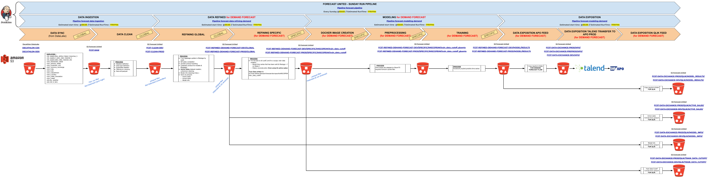

# Demand Forecast : Modeling brick

## Context

This project represents the ML brick of the Demand Forecasting project for APO.

The run pipeline for the entire project is represented hereunder:

Here are the GitHub links to the other blocks of the project:
- [Data Ingestion](https://github.com/dktunited/forecast-data-ingestion.git)
- [Data Refining](https://github.com/dktunited/forecast-data-refining-demand.git)
- [Monitoring](https://github.com/dktunited/forecast-monitoring.git)
- [Automation](https://github.com/dktunited/forecast-automation.git)

## Description

This ML block is orchestrated by a `main.py` file with two command options:
- `--environment`: which can either be `dev` or `prod` (sets the configuration file to use for the project input and output data)
- `--only_last`: which can either be `True` or `False` (determines if the ML brick should run for the last cutoff only or for all available cutoffs)

This `main.py` file does the following:
- First, it build the docker training image for SageMaker, then pushes it to ECR
- Then, it creates a **SageMaker Training Job** through a `boto3` API call
- Lastly, it monitors the status of the training job through `boto3` API calls as well and reports on its status

If you run the project through Jenkins, here's an overview of what happens behind the scenes:

*[Link](https://docs.google.com/drawings/d/1ezlH39R2YX8wLeO-kq1y2u6581DrrfPu5ZINXelC5qI/edit) to edit this architecture*

#### 1. Build & Push the training image
This step is straight forward, it runs the [\_sagemaker\_/build_image.sh](https://github.com/dktunited/forecast-modeling-demand/blob/develop/_sagemaker_/build_image.sh) script which builds the training image from [Dockerfile_train](https://github.com/dktunited/forecast-modeling-demand/blob/develop/_sagemaker_/Dockerfile_train) to package the training source code and its dependencies. Then, it pushes it to [ECR](https://eu-west-1.console.aws.amazon.com/ecr/repositories?region=eu-west-1).

#### 2. Create a SageMaker training job
Through a `boto3` API call with the necessary configurations (set from [dev](https://github.com/dktunited/forecast-modeling-demand/blob/develop/conf/dev.yml) or [prod](https://github.com/dktunited/forecast-modeling-demand/blob/develop/conf/prod.yml)), SageMaker creates a training job as follow:
- First, it pops an ML compute instance (the type of the instance is specified in the configuration file)
- Then, it downloads the training data from the S3 path specified in the API call (set in the configuration file as well)
- Subsequently, it downloads the Docker training image and runs it on the ML instance. The container executes the [train](https://github.com/dktunited/forecast-modeling-demand/blob/develop/src/train) file, which does the following:
    * It proceeds to the last data refinement, prior to training, by transforming `.parquet` input data to `gluonts dataset` format. It saves the pickled `dataset` in the container and uploads it to S3 as well
    * At last, comes the much anticipated model training phase. The current version of the project trains a [Facebook Prophet](https://facebook.github.io/prophet/) model. Unlike ML models, this statistical model does not produce a model artifact for SageMaker to serialize and upload to S3. Since the model learns as it makes predictions, we conclude this step by uploading the resulting forecasts to S3

*PS: You can access SageMaker's training jobs in the AWS console right [here](https://eu-west-1.console.aws.amazon.com/sagemaker/home?region=eu-west-1#/jobs)*

### 3. Monitor the status of the training job
To prevent our `main.py` script from exiting after creating the training job, we implemented a loop to check on the status of the created training job through `boto3` API calls to SageMaker again. This loop reports periodically on the status of the job and terminates with the final status of the training job, that is either **successfully completed** or **failed**.

## Scheduling

This brick is scheduled through Jenkins:
- [Jenkins job](https://forecast-jenkins.subsidia.org/view/PIPELINE-RUN/job/forecast-modeling-demand/)
- The hereinabove job is called upon by this [Run Pipeline](https://forecast-jenkins.subsidia.org/job/forecast-pipeline-demand/) job

## TODO
- Separate data preprocessing (last transformation) from training by having it be run on a different image
- Document functions + Logging + Tests